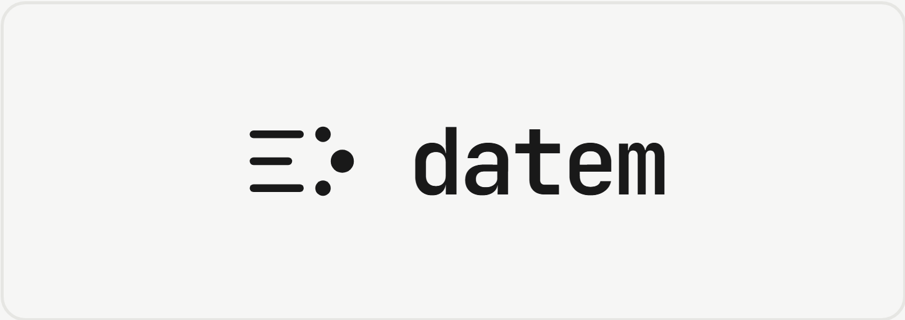

<div align="center">
  
</div>

<br>

> **Warning: Experimental**
>
> This repository is experimental and is not ready for production use. We are exploring a variety of ideas, behavior, interfaces and implementation details may change without notice.
> 

[](https://crates.io/crates/datem)
[](LICENSE)
[]()

Datem is a single Rust binary that turns an S3 bucket into a complete usage metering, analytics, and billing platform. No Kafka. No 

Most companies are moving to usage based billing with AI credits, API calls. There is no need to build your own ingestion engine to track analytics for customers and for billing. Instead use the same method to track and bill. 

---

## Why Datem

Most billing and metering infrastructure looks like this:

```
your app → Kafka → stream processor → ClickHouse → billing engine → Postgres → invoices
```

Every box is a service to deploy, monitor, scale, and debug independently.

Datem collapses that into:

```
your app → datem → S3
```

The same event that drives your product analytics drives your invoicing. No ETL. No reconciliation. No drift between what your dashboards show and what you charge.

---

## How It Works

Datem is built on [Tonbo](https://github.com/tonbo-io/tonbo) — an embedded LSM-tree database that stores everything as Parquet on S3. Writes go through a WAL and MemTable before flushing to S3 as immutable SSTables. MVCC gives you snapshot isolation so billing reads never block event ingestion.

```
HTTP ingest
     │
     ▼
Tonbo (WAL → MemTable → Parquet SSTables on S3)
     │
     ├── DataFusion query layer  ←── SQL analytics + billing aggregations
     │
     └── Billing engine (scheduled)  ──► invoices → Stripe
```

All state — events, customers, subscriptions, invoices — lives in your S3 bucket as standard Parquet files readable by any tool.

---

## Local Development

### Prerequisites

- [Rust](https://rustup.rs) (stable, 1.80+)
- An S3-compatible object store (AWS S3, or [RustFS](https://github.com/rustfs/rustfs) / [MinIO](https://min.io) locally)

### Run with Docker

Build and run the server image:

```bash
docker build -f server/Dockerfile -t datem-server .

docker run \
  -e DATEM_S3_BUCKET=datem \
  -e DATEM_S3_REGION=us-east-1 \
  -e DATEM_S3_ENDPOINT=http://host.docker.internal:9000 \
  -e DATEM_API_KEY=dev-api-key \
  -e DATEM_STRIPE_KEY=sk_test_placeholder \
  -e DATEM_STRIPE_WEBHOOK_SECRET=whsec_placeholder \
  -e AWS_ACCESS_KEY_ID=minioadmin \
  -e AWS_SECRET_ACCESS_KEY=minioadmin \
  -p 3000:3000 \
  datem-server
```

### Run natively

```bash
export DATEM_S3_BUCKET=datem
export DATEM_S3_REGION=us-east-1
export DATEM_S3_ENDPOINT=http://localhost:9000
export DATEM_API_KEY=dev-api-key
export DATEM_STRIPE_KEY=sk_test_placeholder
export DATEM_STRIPE_WEBHOOK_SECRET=whsec_placeholder
export AWS_ACCESS_KEY_ID=minioadmin
export AWS_SECRET_ACCESS_KEY=minioadmin

cargo run --package server
```

### Verify it's running

```bash
curl http://localhost:3000/health
# → 200 OK
```

### Environment variables

| Variable | Required | Default | Description |
|---|---|---|---|
| `DATEM_S3_BUCKET` | ✅ | — | S3 bucket name |
| `DATEM_S3_REGION` | — | `us-east-1` | S3 region |
| `DATEM_S3_ENDPOINT` | — | — | Override endpoint for local stores |
| `DATEM_S3_PREFIX` | — | `datem` | Key prefix inside the bucket |
| `DATEM_API_KEY` | ✅ | — | Bearer token for all protected routes |
| `DATEM_STRIPE_KEY` | ✅ | — | Stripe secret key (`sk_live_...` or `sk_test_...`) |
| `DATEM_STRIPE_WEBHOOK_SECRET` | ✅ | — | Stripe webhook signing secret (`whsec_...`) |
| `DATEM_PORT` | — | `3000` | HTTP listen port |
| `DATEM_RUN_MODE` | — | `server` | `server`, `lambda-ingest`, or `lambda-billing` |
| `DATEM_BILLING_CRON` | — | `0 0 1 * *` | Cron expression for scheduled billing |
| `AWS_ACCESS_KEY_ID` | ✅ | — | S3 access key |
| `AWS_SECRET_ACCESS_KEY` | ✅ | — | S3 secret key |

---

## Quickstart

All protected endpoints require `Authorization: Bearer <DATEM_API_KEY>`.

### 1. Create a metric

```bash
curl -s -X POST http://localhost:3000/metrics \
  -H "Authorization: Bearer dev-api-key" \
  -H "Content-Type: application/json" \
  -d '{"id":"api_calls","display":"API Calls","aggregation":"sum"}' | jq .
```

### 2. Create a customer

```bash
curl -s -X POST http://localhost:3000/customers \
  -H "Authorization: Bearer dev-api-key" \
  -H "Content-Type: application/json" \
  -d '{
    "id": "cust_abc",
    "name": "Acme Corp",
    "email": "billing@acme.com",
    "stripe_customer_id": "cus_stripe123"
  }' | jq .
```

### 3. Define a plan

```bash
curl -s -X POST http://localhost:3000/plans \
  -H "Authorization: Bearer dev-api-key" \
  -H "Content-Type: application/json" \
  -d '{
    "id": "pro",
    "name": "Pro",
    "currency": "usd",
    "interval": "monthly",
    "charges": [
      {
        "metric": "api_calls",
        "model": "per_unit",
        "unit_price": 1
      },
      {
        "metric": "storage_gb",
        "model": "tiered",
        "tiers": [
          { "up_to": 10,   "unit_price": 0 },
          { "up_to": 100,  "unit_price": 2 },
          { "up_to": null, "unit_price": 1 }
        ]
      }
    ]
  }' | jq .
```

All monetary values are **integer cents** — `unit_price: 1` means $0.01 per unit.

### 4. Subscribe a customer

```bash
curl -s -X POST http://localhost:3000/subscriptions \
  -H "Authorization: Bearer dev-api-key" \
  -H "Content-Type: application/json" \
  -d '{
    "customer_id": "cust_abc",
    "plan_id": "pro",
    "stripe_subscription_id": "sub_stripe123"
  }' | jq .
```

### 5. Send events

```bash
curl -s -X POST http://localhost:3000/ingest \
  -H "Authorization: Bearer dev-api-key" \
  -H "Content-Type: application/json" \
  -d '{
    "event_id":    "01HWXYZ123",
    "customer_id": "cust_abc",
    "metric":      "api_calls",
    "quantity":    1,
    "timestamp":   1718918400000000,
    "properties":  { "region": "us-east-1" }
  }' | jq .
```

`event_id` is client-supplied for idempotency — retries with the same ID are safe.

### 6. Query usage

```bash
curl -s -X POST http://localhost:3000/query \
  -H "Authorization: Bearer dev-api-key" \
  -H "Content-Type: application/json" \
  -d '{
    "sql": "SELECT customer_id, SUM(quantity) as total FROM events WHERE metric = '\''api_calls'\'' GROUP BY 1 ORDER BY 2 DESC"
  }' | jq .
```

---

## Debug Dashboard

The web dashboard (live stats, tables, and an ad hoc SQL query box) is a debugging aid, not part of the production server binary. Run it as a separate process — it proxies its API calls to a running `datem` server:

```bash
DATEM_API_URL=http://localhost:3000 DASHBOARD_PORT=4000 cargo run --bin dashboard
```

Then open `http://localhost:4000`. It defaults to proxying `http://localhost:3000` on port `4000` if those env vars are omitted.

---

## Benchmarking

Two tools are available for load testing:

- **`scripts/stress.sh`** — a zero-build bash/curl smoke test, good for a quick check against any running instance (even without a Rust toolchain):

  ```bash
  ./scripts/seed.sh http://localhost:3000 dev-api-key   # populate fixture data
  ./scripts/stress.sh http://localhost:3000 dev-api-key 20 60
  ```

- **`bin/bench`** — a proper Rust load generator with configurable concurrency, duration, and workload mix (`health`, `metrics`, `metrics-get-one`, `ingest-one`, `ingest-batch`, `query`, or `mixed`), reporting p50/p95/p99 latency and req/s per endpoint:

  ```bash
  cargo run --release --bin bench -- \
    --api-url http://localhost:3000 --api-key dev-api-key \
    --workload mixed --concurrency 10 --duration-secs 30
  ```

  `scripts/benchmark-db.sh` runs `bin/bench` through a standard suite of scenarios (concurrency sweep, ingest batch-size sweep, read-heavy vs. write-heavy) and writes a combined JSON report to `bench-results/`:

  ```bash
  ./scripts/benchmark-db.sh http://localhost:3000 dev-api-key 30
  ```

  Both require `scripts/seed.sh` to have been run first so the default fixture data (`api_calls` metric, `cust_acme` customer) exists.

---

## Auth

Datem uses a single operator bearer token (`DATEM_API_KEY`) — it authenticates your backend to datem, not your end customers. Your app resolves the caller's identity through your own auth system, then passes `customer_id` explicitly in each event:

```
Your customer → Your API (your auth) → datem /ingest { customer_id: "cust_abc", ... }
```

---

## Deployment

### Docker

```bash
docker run \
  -e DATEM_S3_BUCKET=my-bucket \
  -e DATEM_S3_REGION=ap-southeast-2 \
  -e DATEM_API_KEY=your-api-key \
  -e DATEM_STRIPE_KEY=sk_live_... \
  -e DATEM_STRIPE_WEBHOOK_SECRET=whsec_... \
  -e AWS_ACCESS_KEY_ID=... \
  -e AWS_SECRET_ACCESS_KEY=... \
  -p 3000:3000 \
  ghcr.io/datem-io/datem:latest
```

### AWS Lambda (serverless)

Two Lambda images are provided — one for ingest (SQS-triggered) and one for billing (EventBridge-triggered). A Terraform sample in [`sample/`](sample/) wires up both functions with SQS, EventBridge, IAM, and an S3 bucket.

See [`sample/README.md`](sample/README.md) for deploy instructions.

---

## Data Model

All tables are Parquet on S3 under your configured prefix:

| Table | Description |
|---|---|
| `events` | Raw usage events — append only |
| `customers` | Customer records |
| `metrics` | Metric definitions |
| `plans` | Pricing plan definitions |
| `charges` | Per-metric charge rules attached to a plan |
| `tiers` | Tier breakpoints for tiered and volume charges |
| `subscriptions` | Customer ↔ plan assignments |
| `billing_runs` | Audit log of each billing engine execution |
| `invoices` | Generated invoices per billing period |
| `invoice_line_items` | Per-metric line items on each invoice |

---

## Pricing Models

All monetary values are **integer cents** (minor currency units).

| Model | Description |
|---|---|
| `flat` | Fixed charge per billing period |
| `per_unit` | Charge per unit of usage (`unit_price` × quantity) |
| `tiered` | Graduated rates — different price per unit in each tier range |
| `package` | Charge per block of N units (`package_size`) |
| `hybrid` | Flat base fee + per-unit usage on top |

---

## SQL Analytics

Datem exposes a DataFusion SQL endpoint at `/query`. Tables available:

```sql
-- Customers approaching their plan limit this period
SELECT
    e.customer_id,
    SUM(e.quantity) AS used
FROM events e
JOIN subscriptions s ON e.customer_id = s.customer_id
WHERE e.metric    = 'api_calls'
  AND e.timestamp >= s.current_period_start
  AND e.timestamp <  s.current_period_end
GROUP BY 1
ORDER BY used DESC;
```

Since events are standard Parquet, you can also query directly with DuckDB, Pandas, or any Arrow-compatible tool.

---

## Architecture

### Single binary, multiple modes

The same binary runs in all deployment modes, controlled by `DATEM_RUN_MODE`:

| Mode | Value | Use case |
|---|---|---|
| Server | `server` (default) | Long-lived HTTP server — Docker, VMs |
| Lambda ingest | `lambda-ingest` | SQS batch handler — AWS Lambda |
| Lambda billing | `lambda-billing` | EventBridge schedule — AWS Lambda |

### IDs

All system-generated IDs are [ULIDs](https://github.com/ulid/spec) — 26-character, lexicographically sortable, URL-safe strings with a millisecond timestamp prefix (e.g. `01HWXYZ1234567890ABCDEFGH`). For `event_id`, the caller supplies their own ID for idempotency.

### S3 layout

```
s3://your-bucket/{prefix}/
├── events/
├── customers/
├── metrics/
├── plans/
├── charges/
├── tiers/
├── subscriptions/
├── billing_runs/
├── invoices/
└── invoice_line_items/
```

Each directory is a Tonbo table — a manifest-coordinated set of Parquet SSTables with MVCC.

### Idempotency

Every event write is idempotent on `event_id`. SQS at-least-once delivery combined with Tonbo's primary key uniqueness means duplicate messages are safely discarded. The billing engine records a `billing_run` before calling Stripe, so duplicate EventBridge invocations for the same subscription period are no-ops.

---

## Integrations

| Integration | Status |
|---|---|
| Stripe | ✅ MVP |
| Paddle | 🔜 Planned |
| Arrow Flight SQL | 🔜 Planned |
| Webhook on invoice | 🔜 Planned |

---

## Status

Datem is **alpha**. The core event ingestion, plan configuration, and billing engine are functional. APIs may change before 1.0.

**MVP scope:**
- [x] Event ingestion with idempotency
- [x] Tonbo/S3 storage backend
- [x] Per-unit, tiered, flat, package, and hybrid pricing models
- [x] Billing engine with Stripe invoice creation
- [x] `/query` SQL endpoint via DataFusion
- [x] Docker deployment
- [x] AWS Lambda deployment sample (Terraform)
- [ ] Public ECR image registry
- [ ] Spend cap enforcement
- [ ] Arrow Flight SQL server
- [ ] Multi-region tenant pinning

---

## Docker images

| Path | Image | Purpose |
|---|---|---|
| `server/Dockerfile` | `ghcr.io/datem-io/datem:latest` | Long-running HTTP server |
| `lambda/Dockerfile` (`FUNCTION=ingest`) | `ghcr.io/datem-io/datem-ingest:latest` | Lambda SQS ingest handler |
| `lambda/Dockerfile` (`FUNCTION=billing`) | `ghcr.io/datem-io/datem-billing:latest` | Lambda billing handler |

Build the server image:

```bash
docker build -f server/Dockerfile -t datem-server .
```

Build a Lambda image (from the workspace root):

```bash
docker build -f lambda/Dockerfile --build-arg FUNCTION=ingest  -t datem-ingest  .
docker build -f lambda/Dockerfile --build-arg FUNCTION=billing -t datem-billing .
```

Lambda images target `public.ecr.aws/lambda/provided:al2023` and name the binary `bootstrap`, as required by the Lambda custom runtime.

---

## Contributing

Datem is Apache 2.0 licensed. Issues and PRs welcome.

```bash
git clone https://github.com/datem-io/datem
cd datem
cargo build
cargo test
```

---

## License

Apache License 2.0 — see [LICENSE](LICENSE).
